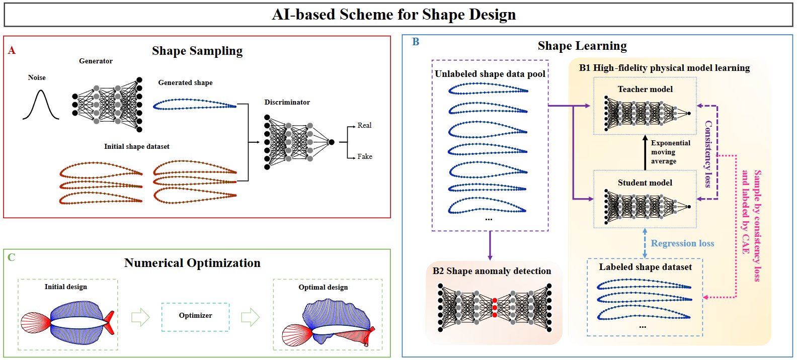

# AISD
The source code for the paper _AI-Based Shape Design_.

## Package Requirement

Basic python environment and other package:

* [torch](https://pytorch.org/)
* [pyoptsparse](https://mdolab-pyoptsparse.readthedocs-hosted.com/en/latest/)
* [xfoil](https://github.com/DARcorporation/xfoil-python/tree/master)
* [aerosandbox](https://github.com/peterdsharpe/AeroSandbox)
* [pyBEMT](https://github.com/kegiljarhus/pyBEMT)

## Experiments

We conduct two kinds of experiments: data-driven design and model-based design.

* **data-driven design**: The initial dataset are come from real world. The code and results
for this part of experiment are in [data-driven-design](data-driven-design).

* **model-based design**: The initial dataset are generated by sampling the space of geometric
parameterization and carefully specifying a set of generated rules to satisfy some geometric conditions, such as non-self-intersection,
naturalistic appearance, **that is not easily described mathematically and accurately**. The code and results
for this part of experiment are in [model-based-design](model-based-design).

A general steps of experiment are shown as follows.

### Step1: Shape Sampling
When obtain an initial dataset, if the amount of data is not enough, we need to
enrich the data. We use WGAN to generate more diverse data. 

In our experiment, only the [airfoil design](data-driven-design/airfoil_design)
exactly use WGAN for sampling. For [wing design](data-driven-design/wing_design) and [rotor design](data-driven-design/rotor_design), their
shape are lofted by some airfoil sections, thus we use the airfoil data already enriched in [airfoil design](data-driven-design/airfoil_design).

For [model-based design](model-based-design), since the design rules are known, we just generate the sufficiency data directly.

### Step2: High-fidelity Physical Model Learning
Usually, we need to label all the data before training model.
But labeling all these data is prohibitively expensive. 

To alleviate this problem, we develop
mean-teacher-based active learning algorithm. This algorithm can select the most informative samples for labeling and
at the same time train the physical model.

### Step3: Shape Anomaly Detection
In general design optimization problems, the design variable tend to be overly redundant,
which lead to shape anomaly problem. 

To alleviate this, we use auto-encoder to reconstruct the normal shapes.
The auto-encoder can learn the intrinsic features of the normal shapes, when an abnormal shape is fed, the auto-encoder
would not reconstruct the data well. Large reconstruction error means that the sample is more likely to be an anomaly.
Therefore, we can embed the reconstruct error constrain into the design optimization problem.

The critical factor impacting the performance of auto-encoder training 
is the choice of the dimension of the latent space. We apply local PCA to compute the intrinsic dimension of the data.

### Step4: Numerical Optimization

When the physical model and auto-encoder are trained, we implement a gradient-based optimization algorithm
incorporating the trained physical model and the auto-encoder, while adhering to the reconstruction constraint and desired
properties constraints, to craft the optimal shape. This part of experiment requires [pyoptsparse](https://mdolab-pyoptsparse.readthedocs-hosted.com/en/latest/).