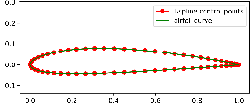
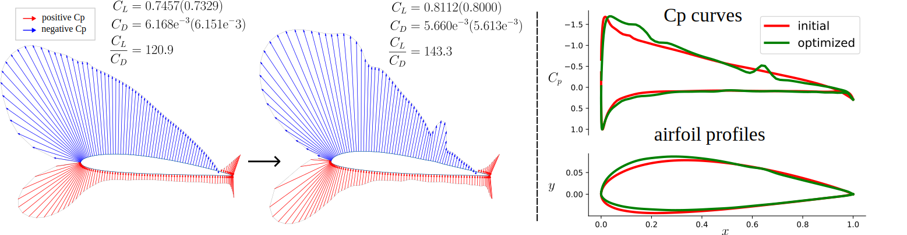
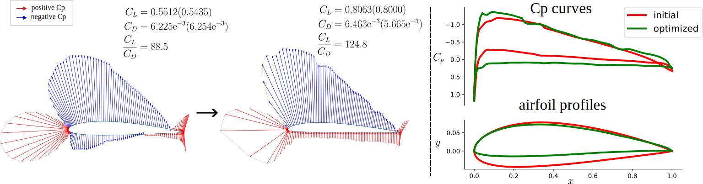

# Airfoil Design

The airfoil design is aimed to minimize the drag coefficient ($C_D$) while keeping lift coefficient ($C_L$) greater
than a given value, thus improving the lift-drag ratio.

The airfoil dataset is based on [UIUC dataset](https://m-selig.ae.illinois.edu/ads/coord_database.html) 
which contain more than 1,600 real-world airfoil design.
We use the [open-source script](https://github.com/npuljc/Airfoil_preprocessing) to remove
abnormal airfoils and obtain 1,433 airfoils, which are stored in [data_bs/pts](data_bs/pts).

We construct two distinct cubic B-spline curves with 34 control points for the upper surface 
and lower surface of the airfoil, respectively. The two end control points of each B-spline curve are fixed
at the leading edge (0, 0) and the trailing edge (1, 0). The control points data are stored in
[data_bs/controls](data/controls). Finally, all control points data are concatenated in a numpy array 
[bs_datas.npy](data_bs/bs_datas.npy).

<figure align="center">
    
    <figcaption>airfoil parameters</figcaption>
</figure>

## Shape Sampling
Firstly, we shall enrich the control points data. We apply WGAN-GP to do it. Run the following code

```
python main_gan.py --lr 1e-4 --batch_size 128 --lambda_gp 10 --regular 0.3 --nEpoch 100000 --wass
```
The trained generator are stored in [resultsWGAN](shape-sampling/resultsWGANGAN_ngf*ndf=64*64_wass_True). 
We use this generator to obtain more data, finally, the generated data and origin data are stored in
[data_extend_wgan.npy](config/data_extend_wgan.npy), with a total of 46,286 items.


## High-fidelity Physical Model Learning

There two kinds of fluid conditions are considered: 

* incompressible: $Re=6.5e6, Ma=0.150$, angel of attack $\alpha$ ranges over $[0^\circ, 10^\circ]$ with $0.1^\circ$ 
gridsizes.

* compressible: $Re=6.5e6, Ma=0.150$, angel of attack $\alpha$ ranges over $[0^\circ, 3^\circ]$ with $0.03^\circ$ 
gridsizes.

Therefore, there are a total of 4,628,600 items need to be labeled under each fluid condition.
For each item, we use [Xfoil](https://github.com/DARcorporation/xfoil-python/tree/master)
to calculate the corresponding $C_L, C_D$. Usually, the cost of labelling is huge. 
Consequently, we apply mean-teacher-based active learning algorithm to select 500,000 items for labeling and 
learn a physical model. For the convenience, all items are labelled at once and stored in
[remake_data_v2_ma150.npy](config/remake_data_v2_ma150.npy) and
[remake_data_v2_ma734.npy](config/remake_data_v2_ma734.npy), corresponding to
fluid condition $Ma=0.150$ and $Ma=0.734$. These corresponding codes are located in [mean-teacher-al](mean-teacher-al).

Run the following code under the directory [mean-teacher-al](mean-teacher-al)
```
python main.py --ma 150 # incompressible fluid case

python main.py --ma 734 # compressible fluid case
```

The corresponding network's parameters are stored in 
[results-al-semi-150](mean-teacher-al/results-al-semi-150) and 
[results-al-semi-734](mean-teacher-al/results-al-semi-734), respectively. 
And the learning results are as follows.

|  Ma   | $\text{RMAE}_{C_L}$ | $\text{RMAE}_{C_D}$ |
|:-----:|:-------------------:|:-------------------:|
| 0.150 |      5.193E-3       |      2.156E-2       |
| 0.734 |      1.058E-2       |      6.690E-2       |


## Shape Anomaly Detection

The critical factor impacting the performance of auto-encoder training 
is the choice of the dimension of the latent space.
So run the following code.
```
python lpca.py
```
The result should be 5(round up). This give a lower bound of the dimension of latent space. In our experiment, we choose 16.
Run the following code to train the auto-encoder.
```
python main_ae.py --embed-dim 16
```
The corresponding parameters are stored in [resultsAE_ID=16_wgan](shape-anomaly-detection/resultsAE_ID=16_wgan).
And the result are as follows.

|       index       |  value   |
|:-----------------:|:--------:|
|   ReconErr mean   | 2.283E-3 |
| ReconErr variance | 2.199E-5 |

## Numerical Optimization

We use naca2412 as the initial airfoil. Run the following code.

```
python shapeOptALSSL.py --ma 150 # 734
```

And the optimized results are located in [optimize_results](optimize_results).

<figure align="center">
    
    <figcaption>mach=0.150</figcaption>
    
    <figcaption>mach=0.734</figcaption>
</figure>