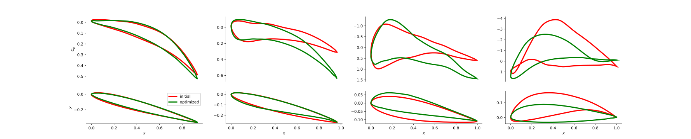

# Rotor Design

The objective of rotor design is to minimize the torque coefficient ($C_Q$)
while ensuring that the thrust coefficient ($C_T$) larger than a given value,
thus improving the efficiency of the rotor.

## Shape Sampling

The rotor model is consist of $n_{\text{blade}}$ blades, each blade is modeled by
lofting four airfoil sections, as shown in the following figure. 
<div>

</div>

Similar to the [wing design](../wing_design), 
we use the airfoil generated in [airfoil design](../airfoil_design) to build the dataset.
See Appendix E for more details.

Finally, thera are a total of 128,000,000 items necessitates labeling.

## High-fidelity Physical Model Learning

We employ the mean-teacher-based active learning algorithm on this dataset,
the budget of algorithm is 1,000,000. The corresponding $C_T, C_Q$ are computed by
[pyBEMT](https://github.com/kegiljarhus/pyBEMT). For the convenience of the
experiment, all data labelling is done at once in advance, the corresponding
data and label are stored in [rotor_dataset](rotors_dataset).

Before the experiment, run the following code under the directory [rotor_dataset](rotors_dataset).

```
python merge_rotor_values.npy
```

Then run the following code.
```
python main.py
```
The corresponding network's parameters are stored in [results-al](results_al).
And the learning results are as follows.

| \text{RMAE}_{C_T} | $\text{RMAE}_{C_Q}$ |
|:-----------------:|:-------------------:|
|      2.749-3      |      2.784E-3       |

## Shape Anomaly Detection

Like [wing design](../wing_design), the shape anomaly detection unit is the airfoil section, 
thus we still use the auto-encoder trained in [airfoil design](../airfoil_design).

## Numerical Optimization

Run the following code.
```
python shape_opt.py
```
And the optimized results will be stored in [optimize_results](optimize_results), which are shown as follows.

<div align="center">



</div>