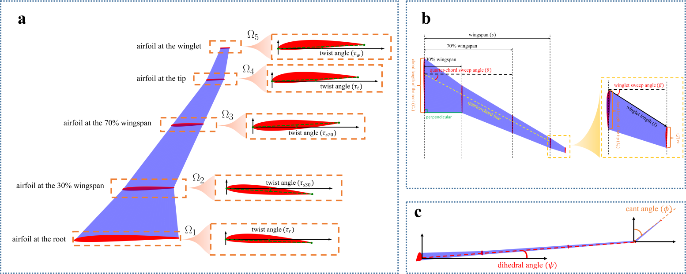
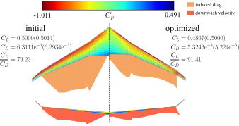
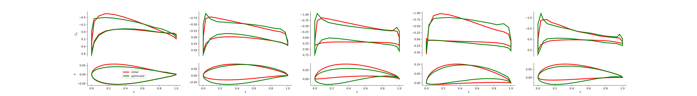

# Wing Design

The goal of wing design is similar to the airfoil design, both are aim to minimize
drag coefficient ($C_D$) while maintaining the lift coefficient ($C_L$) larger than a given value.

## Shape Sampling

A wing is modeled by lofting five airfoil sections (see Appendix D for more details), as shown in the following figure.


Each airfoil section's parameters are same as one in [airfoil design](../airfoil_design).
And the airfoil sections are from the dataset [data_extend_wgan.npy](../airfoil_design/config/data_extend_wgan.npy).
We build a total of 32,000,000 data items for labeling and training.

## High-fidelity Physical Model Learning

Like airfoil design, we employ the mean-teacher-based active learning algorithm to select 500,000 items for labeling
and training. We use [aerosandbox](https://github.com/peterdsharpe/AeroSandbox) to label data.
All the labeled data are stored in 
[data_train_wings_part1](config/data_train_wings_rmmtw_new_0_100000.npy),
[data_train_wings_part2](config/data_train_wings_rmmtw_new_100000_200000.npy),
[data_train_wings_part3](config/data_train_wings_rmmtw_new_200000_300000.npy),
[data_train_wings_part4](config/data_train_wings_rmmtw_new_300000_400000.npy),
[data_train_wings_part5](config/data_train_wings_rmmtw_new_400000_500000.npy).

Then, run the following code under the directory [mean-teach-al](mean-teacher-al).
```
python main.py
```
The corresponding network's parameters are stored in [results-al-semi](mean-teacher-al/results-al-semi).
And the learning results are as follows.

| \text{RMAE}_{C_L} | $\text{RMAE}_{C_D}$ | $\text{RMAE}_{V}$ |
|:-----------------:|:-------------------:|:-----------------:|
|     2.677E-3      |      4.304E-3       |     2.231E-3      |


## Shape Anomaly Detection

Since the shape anomaly detection unit is the airfoil section, 
thus we still use the auto-encoder trained in [airfoil design](../airfoil_design).


## Numerical Optimization

Run the following code.
```
python shape_opt.py
```
And the optimized results will be stored in [optimize_results](optimize_results), And the optimized results are located in [optimize_results](optimize_results), 
which are shown as follows.



