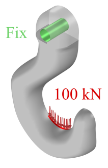
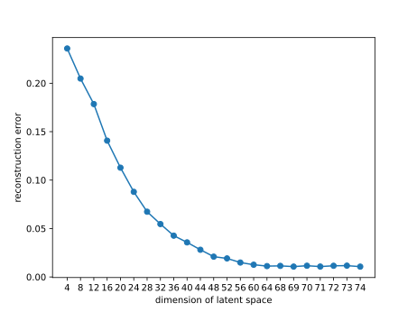

# Hook Design

The objective in the hook design is to identify an optimal shape that enhances the stiffness
while adhering to specific volume constraints and loads. This can be achieved by minimizing
the strain energy. The physical boundary conditions are as follows.
<div align="center">

</div>

## Shape Sampling

We model the half of the hook by lofting 11 2D sections along a guideline, 
the procedure for constructing a hook is as follows, see Appendix G for more details.
<div align="center">

</div>

For maintaining a naturalistic semblance characterized by smoothness and minimal undulation, 
we apply mean filter to each section once or two at random (each section are generated independently and randomly),
considering its neighboring sections.

Finally, we generate a total of 222,141 shape data points. All data are stored in [data](data).

## High-fidelity Physical Model Learning

We employ the mean-teacher-based active learning algorithm on this dataset, to select 50,000 shapes
for labeling and train the physical model, the corresponding labels are obtained by COMSOL.

Run the following code under the directory [mean-teacher-al](mean-teacher-al).

```
python main.py
```

The trained model is stored in [net_best_teacher.tar](mean-teacher-al/results-al-semi/net_best_teacher.tar),
and the learning results is as follows.

| $\text{RMAE}_E$ | $\text{RMAE}_V$ |
|:---------------:|:---------------:|
|    4.308E-3     |    1.818E-3     |

## Shape Anomaly Detection

Firstly, run the following code to compute the intrinsic dimension.

```
python lpca.py
```

The results should be 68 (round up). For verifying that the value is sufficient, 
we examine the reconstruction error as a function
of the dimension of latent space, which are shown as follows.
<div align="center">
    
</div>

We choose 68 as the dimension of the latent space in
the auto-encoder. Run the following code for training.

```
python main_ae.py --embed-dim 68
```

The trained model are stored in [results_aeID=68](shape-anomaly-detection/results_aeID=68). 
The learning results of auto-encoder are documented in the following table.

| ReconErr mean | ReconErr variance |
|:-------------:|:-----------------:|
|   1.143E-2    |     9.055E-5      |

## Numerical Optimization

We perform two kinds of optimization problem with a [given initial hook](optimized_results/x_init.npy).

* P1: $\min E$ s.t. $V\leq0.5V_{\text{init}}$
* P2: $\min V$ s.t. $E\leq0.5E_{\text{init}}$

Run the following code

```
python shape_opt_pysparse.py --prob minEconV # problem 1

python shape_opt_pysparse.py --prob minVconE # problem 2
```

Both optimized results are located in [optimize_results](optimized_results).
The following figure shows the comparison of our optimized results and the COMSOL's optimized results.

<div align="center">
    
</div>