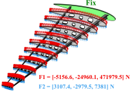
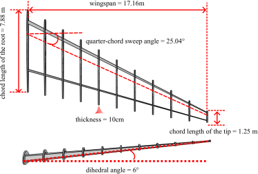
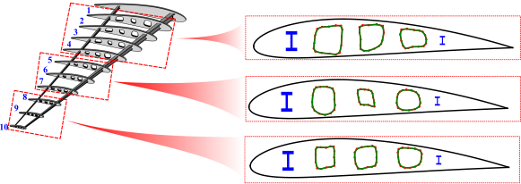
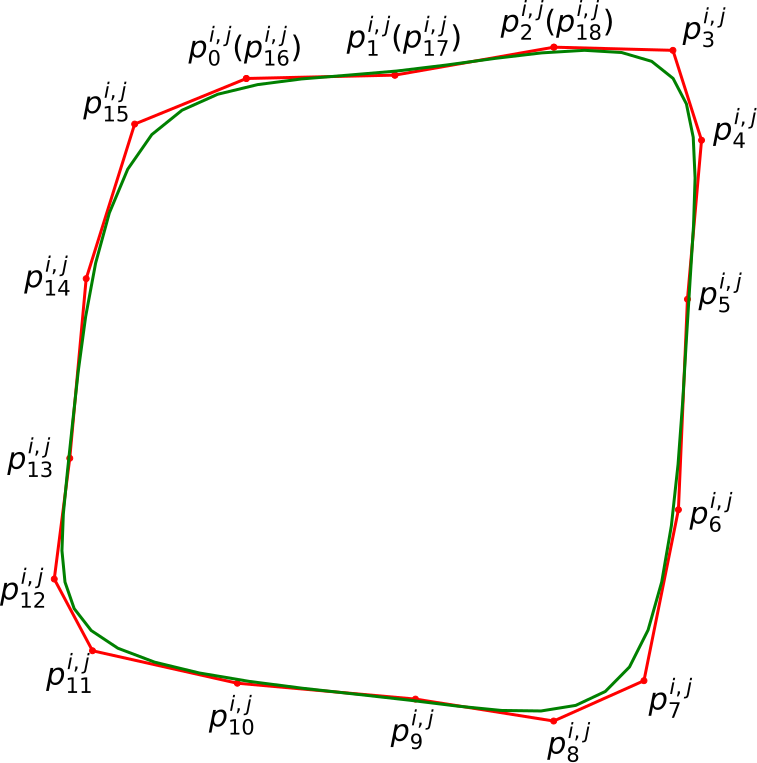
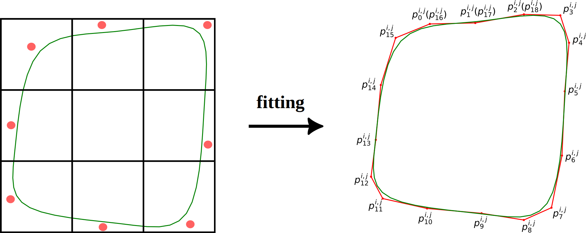
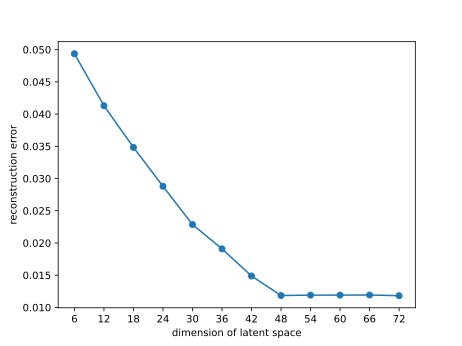
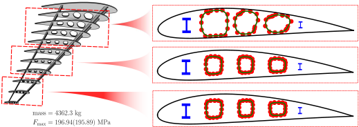

# Wing Ribs Design

The objective of wing ribs design is to minimize the mass while adhering to the maximum allowable
von Mises force constraint. And the physical boundary conditions are as follows.
<div align="center">

</div>

## Shape Sampling

The wing consists of 11 wing ribs and two wing spars, as shown as follows.

<div align="center">


</div>

The profile of each rib is NACA4415, 
and each rib has three cutouts which are parameterized by a uniform periodic cubic B-spline, 
our target is to design these cutouts, as shown as follows, see Appendix F for more details

<div align="center">

</div>

Our experiments are all conducted in high-dimensional design scenarios to demonstrate the
generalisability of our scheme. Therefore, we use 19 control points to construct the cutout.
Also, we need to keep these cutouts curves exhibit a naturalistic appearance devoid of
excessive torsion or self-intersection. For ensuring that, we first use 8 control points 
to construct the cutouts, which are restricted to disjoint regions, and then fit these 
cutouts with 19 control points. As shown as follows.

<div align="center">

</div>

At last, we generate a total 244,487 rib data points. The data are stored in [data](data).

## High-fidelity Physical Model Learning

We use the mean-teacher-based active learning algorithm to select 50,000 shapes 
for labeling and training, the selected data would be labelled by COMSOL. 
For the convenience of the experiment, all data are labelled beforehand, and are stored in [data](data).
Run the following code under [mean-teacher-al](mean-teacher-al).
```
python main.py
```

The trained model is stored in [net_best_teacher.tar](mean-teacher-al/results-al-semi/net_best_teacher.tar).

## Shape Anomaly Detection

Since the three cutouts in each rib are independent, we utilize three separate auto-encoders
to reconstruct the corresponding cutouts.

The critical factor impacting the performance of auto-encoder training 
is the choice of the dimension of the latent space.
So run the following code.
```
python lpca.py
```

The result should be 48(round up), since there are three positions of cutouts(left, middle and right), 
which means each cutout has the intrinsic dimension of 16, that is exactly the dimension of 8 control points.
This give a lower bound of the dimension of latent space. 
For verifying that the value is sufficient, we examine the reconstruction error as a function
of the dimension of latent space, which are shown as follows.

<div align="center">
    
</div>

In our experiment, we choose 24 as the dimension of the latent space in each auto-encoder.
Run the following code to train the auto-encoder.

```
python main_ae.py --embed-dim 24
```
The corresponding parameters are stored in [results_ae_ID=24](shape-anomaly-detection/results_ae_ID=24).

The learning results of physical model and auto-encoder are documented in the following table.

| $\text{RMAE}_{F_{\text{vm}}}$ |   ReconErr mean    | ReconErr variance |
|:-----------------------------:|:------------------:|:-----------------:|
|           1.1393E-1           |     1.1821E-2      |     7.4780E-6     |


## Numerical Optimization

We use naca2412 as the initial airfoil. Run the following code.

```
python shapeOpt.py
```

And the optimized results are located in [optimize_results](optimized_results), 
which is optimized with from an initial configuration with mass 4646.53 kg and $F_{\text{vm}}$ 189.55MPa.
The results are shown as follows.
<div align="center">
    
</div>